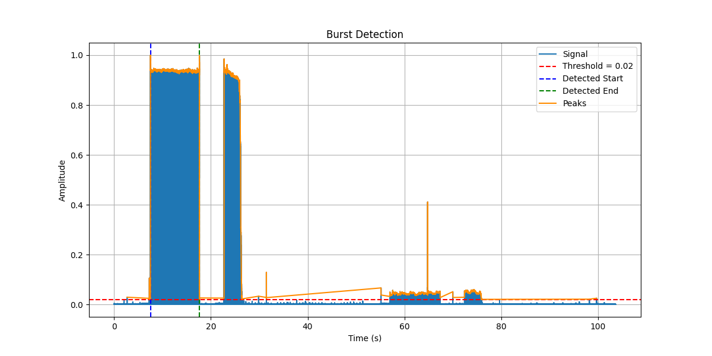

# Sweep File Splitter
1.1.0

## Overview
This script processes a stereo audio file (WAV format) to detect and extract sweep segments from specific test records. This stand-alone version has debugging features that the version integrated with SJPlot does not.

**Version 1.1.0 introduces significant improvements:**
- **Hilbert envelope detection** for pilot tone and sweep detection - more robust and sample-rate independent
- **Automatic frequency range detection** - works with sweeps ending anywhere from 10kHz to 75kHz without configuration
- **40x faster processing** - optimized detection algorithms significantly improve performance
- **No manual tuning required** - works seamlessly across 44.1kHz, 96kHz, 192kHz sample rates


## Features
- Reads stereo WAV files and processes both left and right channels.
- Detects pilot tones and sweep signals using customizable parameters.
- Applies bandpass and high-pass filters to isolate signal regions of interest.
- Visualizes signals with optional plots for debugging and analysis.
- Extracts and saves the detected segments into separate output WAV files.

## Requirements
The script requires the following Python libraries:

- numpy
- scipy
- matplotlib

You can install them using pip:

```bash
pip install numpy scipy matplotlib
```

## Usage
This scrip uses command-line arguments only.  These arguments are:
### Configuration Parameters

| **Parameter**     | **Default** | **Description**                                                   |
|-----------------| :---: |-------------------------------------------------------------------|
| file            | |The wave file to extract sweeps from. |
| test_record     | |The test record the audio was captured from. A list of supported records are in the table below. |
| no_save         | |If this argument is passed the extracted sweeps will not be saved to file. |
| log_level       |`info`|`info`: standard logging level<br>`debug`: verbose logging intended for debugging issues. This also enables the visualizations. |
| version         | |Output sofware version and exit. |
| help            | |Display the help contents and exit. |


Each test record type adjusts parameters such as sweep offset and detection ranges.

### Supported Test Records

| **Test Record** | **Parameter** | **Description** |
|-----------------| :---: |-----------------|
| TRS-1007        | `TRS1007`     | JVC/Victor - Frequency Response Test 20Hz-20kHz |
| CA-TRS-1007     | `TRS1007`     | clearaudio - Frequency Response Test Record 20Hz - 20kHz |
| TRS-1005        | `TRS1005`     | JVC/Victor - High Frequency Response Test 1kHz - 50kHz |
| STR-100         | `STR100`      | CBS Laboratories - Professional Test Record (40Hz - 20kHz) |
| STR-120         | `STR120`      | CBS Laboratories - Wide Range Pickup Test (500Hz - 50kHz) |
| STR-130         | `STR130`      | CBS Laboratories - RIAA System Response Test (40Hz - 20kHz) |
| STR-170         | `STR170`      | CBS Laboratories - 318-Microsecond Frequency Response Test (40Hz - 20kHz) |
| QR 2009         | `QR2009`      | Brüel & Kjær - Stereophonic Gliding Frequency Record 20-20 000 Hz |
| QR 2010         | `QR2010`      | Brüel & Kjær - Stereo Test Record 5 Hz - 45 kHz |
| XG-7001         | `XG7001`      | Denon - Denon Technical Test Record (20Hz - 20kHz) |
| XG-7002         | `XG7002`      | Denon - Denon Audio Technical Test Record - Pick Up Test I (1kHz - 50kHz) |
| XG-7005         | `XG7005`      | Denon - Denon Audio Technical Test Record - RIAA System Test (20Hz - 20kHz) |
| DIN 45 543      |  `DIN45543`   | DIN - Frequenzgang - Und Übersprech-Mess-Schallplatte (20Hz - 20kHz) |
| ИЗМ33С0327      |  `ИЗМ33С0327` | Пластинка для измерения частотных характеристик, разделения между стереоканалами и чувствительности стереозвукоснимателей | 

## Running the Script
Run the script using Python:

```bash
python splitter.py --file MyFile.wav --test_record STR100
```

For file names that have spaces or special characters, you'll need to capture the name in quotes:

```bash
python splitter.py --file "My Long File Name.wav" --test_record STR100
```

## Output Files
The script generates two output files:

- <input_file>_L.wav: Extracted segment for the left channel.
- <input_file>_R.wav: Extracted segment for the right channel.

## Customization
The script allows customization of the following parameters:

- Filter configurations (low, high, order, etc.).
- Peak detection thresholds and burst boundaries.
- Test record-specific parameters in the record_params dictionary.

## Debugging and Visualization
Signal processing steps can be visualized with plots by enabling logging at the DEBUG level.
To enable detailed logging and the visualizations, use the `--log_level` argument:

```bash
python splitter.py --file MyFile.wav --test_record STR100 --log_level debug
```

### Burst Detection Visualization
Where: find_burst_bounds_hilbert

This plot shows the process of identifying a "burst" (pilot tone) within the signal using the Hilbert envelope method.

Key Features:
- Normalized Signal: The smooth Hilbert envelope of the filtered 1kHz signal.
- Threshold: Horizontal line at 0.3 (30% of peak amplitude) used to identify the pilot tone.
- Detected Start and End Times: Vertical lines marking where the pilot tone begins and ends.

Purpose: This confirms the Hilbert envelope algorithm correctly identifies the 1kHz pilot tone region. The envelope-based approach is more robust than the previous peak-spacing method and works across all sample rates without tuning.

#### Examples
<br/>
<div align="center" style="padding: 20px 0;">
    
    <p><b>Figure 1 - First Burst Detection Pass: Left Channel</b></p>
    <p>Used to find the end of the first 1kHz pilot tone. In most cases this is also the start of the sweep.</p>
</div>
<br/>

### Sweep Start Detection Visualization
Where: find_sweep_start (only for TRS1005 and XG7002)

For test records where the sweep starts several seconds after the pilot tone ends, this plot shows detection of the sweep's energy rise at 1kHz.

Key Features:
- Normalized Signal: The smooth Hilbert envelope showing energy trend at 1kHz.
- Threshold: Horizontal line at 0.2 (20% of peak) used to detect energy rise.
- Detected Start Time: Vertical line marking where sweep energy begins to rise.

Purpose: This confirms detection of the actual sweep start for records like TRS1005 and XG7002 that have silence between pilot tone end and sweep start.

#### Examples
<br/>
<div align="center" style="padding: 20px 0;">
    
    <p><b>Figure 2 - Sweep Start Detection: Left Channel</b></p>
    <p>Used to find the start of the sweep when there is silence after the pilot tone. This detection window begins one second after the detected end of the pilot tone and searches for 10 seconds.</p>
</div>
<br/>

<br/>
<div align="center" style="padding: 20px 0;">
    
    <p><b>Figure 2 (old location) - Second Burst Detection Pass: Right Channel</b></p>
    <p><b>Figure 2 (old location) - Second Burst Detection Pass: Right Channel</b></p>
    <p>Used to find the end of the second 1kHz pilot tone. In most cases this is also the start of the sweep. The start of this detection window is offset by "sweep_offset" seconds from the end of the first pilot tone.</p>
</div>
<br/>

<br/>
<div align="center" style="padding: 20px 0;">
    
    <p><b>Figure 4 - Sweep Start Detection: Right Channel</b></p>
    <p>Used to find the start of the right channel sweep when there is silence after the pilot tone. This detection window begins one second after the detected end of the second pilot tone and searches for 10 seconds.</p>
</div>
<br/>

### Sweep End Detection Visualization
Where: find_end_of_sweep_hilbert

This visualization shows detection of the sweep's end using Hilbert envelope analysis. The algorithm automatically works for sweeps ending anywhere from 10kHz to 75kHz.

Key Features:
- Normalized Signal: The smooth Hilbert envelope of the high-pass filtered signal (>5kHz).
- Threshold: Horizontal line at 0.05 (5% of peak) marking the detection threshold.
- Detected End Time: Vertical line indicating where the high-frequency energy drops below threshold.

Purpose: Confirms the end-of-sweep detection identifies the correct endpoint. The 5kHz highpass filter catches energy drops from sweeps ending at any frequency above 5kHz, making it work automatically for 10kHz, 20kHz, 50kHz, or 75kHz sweep endpoints.

#### Examples
<br/>
<div align="center" style="padding: 20px 0;">
    
    <p><b>Figure 5 - First End of Sweep Detection Pass: Left Channel</b></p>
    <p>Used to find the end of the left channel sweep.  The distance and duration of this detection window are set by the variables "sweep_end_min" and "sweep_end_max".</p>
</div>
<br/>

<br/>
<div align="center" style="padding: 20px 0;">
    
    <p><b>Figure 6 - First End of Sweep Detection Pass: Right Channel</b></p>
    <p>Used to find the end of the right channel sweep.  The distance and duration of this detection window are set by the variables "sweep_end_min" and "sweep_end_max".</p>
</div>
<br/>

### Segment Visualization
Where: At the end of slice_audio

This shows the final extracted segments (sweeps) for both the left and right channels.

Key Features:
- Segment Plot: Displays the portion of the signal identified as the sweep.
- Title: Indicates whether the plot corresponds to the left or right channel.

Purpose: This visualization allows you to verify that the extracted segments correspond to the expected sweep regions.

#### Examples
<br/>
<div align="center" style="padding: 20px 0;">
    
    <p><b>Figure 7 - Extracted Sweep Segment: Left Channel</b></p>
    <p>This is a waveform visualization of the extracted sweep segment for the left channel.</p>
</div>
<br/>

<br/>
<div align="center" style="padding: 20px 0;">
    
    <p><b>Figure 8 - Extracted Sweep Segment: Right Channel</b></p>
    <p>This is a waveform visualization of the extracted sweep segment for the right channel.</p>
</div>
<br/>


## Technical Details

### Version 1.1.0 Algorithm Improvements

**Pilot Tone Detection (find_burst_bounds)**
- Uses Hilbert transform to extract smooth amplitude envelope from bandpass-filtered 1kHz signal
- Searches first 20 seconds of each channel
- Detects sustained tone regions above 30% threshold with minimum 1-second duration
- Sample-rate independent - no tuning needed for 44.1kHz, 96kHz, or 192kHz files

**Sweep Start Detection (find_sweep_start)** 
- Only used for TRS1005 and XG7002 where sweep starts after silence
- Detects energy rise at 1kHz (sweep start frequency) 
- Searches 10 seconds starting 1 second after pilot tone ends
- Uses Hilbert envelope with 200ms smoothing to track energy trends

**Sweep End Detection (find_end_of_sweep)**
- Automatically works for sweeps ending 10kHz-75kHz without configuration
- Uses 5kHz highpass filter - catches energy drop regardless of sweep end frequency
- Searches within configured sweep_end_min to sweep_end_max time window (typically 4 seconds)
- Detects first sustained drop below 5% threshold lasting 50ms
- Vectorized algorithm provides 40x speedup over previous convolution method

**Performance Optimizations**
- Fixed search windows eliminate adaptive overhead
- Fast uniform_filter1d for envelope smoothing
- Vectorized region detection using np.diff instead of convolution
- Typical processing time: 0.3-0.5 seconds for full stereo sweep extraction

## Contributing
Contributions to improve the script are welcome. Please feel free to fork the repository, make your changes, and submit a pull request.

## License
This project is licensed under the MIT License - see the LICENSE file for details.
