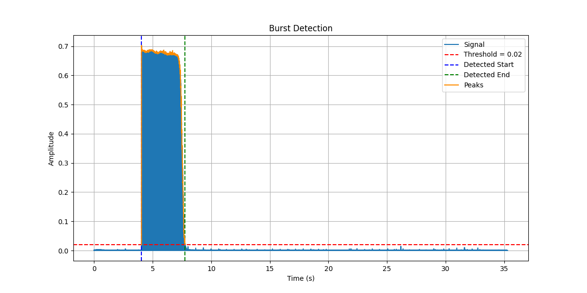
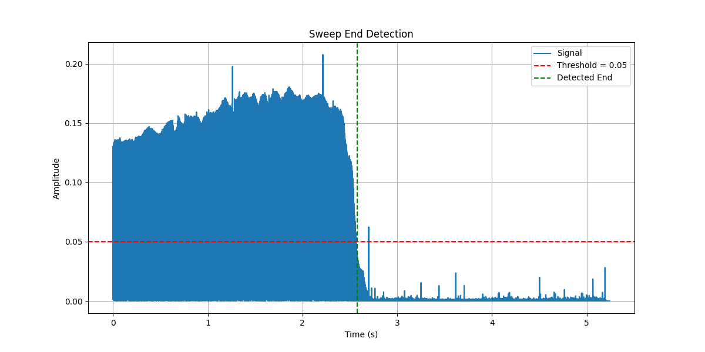

# Sweep File Splitter
1.0.11

## Overview
This script processes a stereo audio file (WAV format) to detect and extract sweep segments from specific test records.  This stand-alone version has debugging featuers that the version integrated with SJPlot does not. 

Much thanks to DrCWO for contrbuting the Scilab code this is based on. 

## Features
- Reads stereo WAV files and processes both left and right channels.
- Detects pilot tones and sweep signals using customizable parameters.
- Applies bandpass and high-pass filters to isolate signal regions of interest.
- Visualizes signals with optional plots for debugging and analysis.
- Extracts and saves the detected segments into separate output WAV files.

## Requirements
The script requires the following Python libraries:

- numpy
- scipy
- matplotlib

You can install them using pip:

```bash
pip install numpy scipy matplotlib
```

## Usage
This scrip uses command-line arguments only.  These arguments are:
### Configuration Parameters

| **Parameter**     | **Default** | **Description**                                                   |
|-----------------| :---: |-------------------------------------------------------------------|
| file            | |The wave file to extract sweeps from. |
| test_record     | |The test record the audio was captured from. A list of supported records are in the table below. |
| save_sweeps     |`True`|`True`: save the extracted sweep files<br>`False`: do not save files |
| log_level       |`info`|`info`: standard logging level<br>`debug`: verbose logging intended for debugging issues. This also enables the visualizations. |
| version         | |Command-line only - output sofware version and exit. |
| help            | |Command-line only - display the help contents and exit. |


Each test record type adjusts parameters such as sweep offset and detection ranges.

## Supported Test Records

| **Test Record** | **Parameter** | **Description** |
|-----------------| :---: |-----------------|
| TRS-1007        | `TRS1007`     | JVC/Victor - Frequency Response Test 20Hz-20kHz |
| CA-TRS-1007     | `TRS1007`     | clearaudio - Frequency Response Test Record 20Hz - 20kHz |
| TRS-1005        | `TRS1005`     | JVC/Victor - High Frequency Response Test 1kHz - 50kHz |
| STR-100         | `STR100`      | CBS Laboratories - Professional Test Record (40Hz - 20kHz) |
| STR-120         | `STR120`      | CBS Laboratories - Wide Range Pickup Test (500Hz - 50kHz) |
| STR-130         | `STR130`      | CBS Laboratories - RIAA System Response Test (40Hz - 20kHz) |
| STR-170         | `STR170`      | CBS Laboratories - 318-Microsecond Frequency Response Test (40Hz - 20kHz) |
| QR 2009         | `QR2009`      | Brüel & Kjær - Stereophonic Gliding Frequency Record 20-20 000 Hz |
| QR 2010         | `QR2010`      | Brüel & Kjær - Stereo Test Record 5 Hz - 45 kHz |
| XG-7001         | `XG7001`      | Denon - Denon Technical Test Record (20Hz - 20kHz) |
| XG-7002         | `XG7002`      | Denon - Denon Audio Technical Test Record - Pick Up Test I (1kHz - 50kHz) |
| XG-7005         | `XG7005`      | Denon - Denon Audio Technical Test Record - RIAA System Test (20Hz - 20kHz) |
| DIN 45 543      |  `DIN45543`   | DIN - Frequenzgang - Und Übersprech-Mess-Schallplatte (20Hz - 20kHz) |

## Running the Script
Run the script using Python:

```bash
python splitter.py --file MyFile.wav --test_record STR100
```

For file names that have spaces or special characters, you'll need to capture the name in quotes:

```bash
python splitter.py --file "My Long File Name.wav" --test_record STR100
```

## Output Files
The script generates two output files:

- <input_file>_L.wav: Extracted segment for the left channel.
- <input_file>_R.wav: Extracted segment for the right channel.

## Customization
The script allows customization of the following parameters:

- Filter configurations (low, high, order, etc.).
- Peak detection thresholds and burst boundaries.
- Test record-specific parameters in the record_params dictionary.

## Debugging and Visualization
Signal processing steps can be visualized with plots by enabling logging at the DEBUG level.
To enable detailed logging, use the `--log_level` argument:

```bash
python splitter.py --file MyFile.wav --test_record STR100 --log_level debug
```

### Burst Detection Visualization
Where: find_burst_bounds

This plot shows the process of identifying a "burst" within the signal, typically corresponding to a specific pattern or tone.

Key Features:
- Peaks: Displays the detected peaks in the signal to ensure proper burst detection.
- Threshold: Highlights the value used to determine significant peaks.
- Detected Start and End Times: Vertical lines marking the burst's start and end points.

Purpose: This helps confirm that the burst detection algorithm correctly identifies the expected signal region.

#### Examples
<br/>
<div align="center" style="padding: 20px 0;">
    
    <p><b>Figure 1 - First Burst Detection Pass: Left Channel</b></p>
    <p>Used to find the end of the first 1kHz pilot tone. In most cases this is also the start of the sweep.</p>
</div>
<br/>

<br/>
<div align="center" style="padding: 20px 0;">
    
    <p><b>Figure 2 - Optional Sweep Start Detection Pass: Left Channel</b></p>
    <p>In cases like JVC TRS-1005 were there is silence between the end of the pilot tone and the start of the sweep, this is used to find the start of the sweep. This detection window begins one second after the detected end of the pilot tone.</p>
</div>
<br/>

<br/>
<div align="center" style="padding: 20px 0;">
    
    <p><b>Figure 3 - Second Burst Detection Pass: Right Channel</b></p>
    <p>Used to find the end of the second 1kHz pilot tone. In most cases this is also the start of the sweep. The start of this detection window is however many seconds "sweep_offset" is configured for from the end of the first pilot tone.</p>
</div>
<br/>

<br/>
<div align="center" style="padding: 20px 0;">
    
    <p><b>Figure 4 - Optional Sweep Start Detection Pass: Right Channel</b></p>
    <p>In cases like JVC TRS-1005 were there is silence between the end of the pilot tone and the start of the sweep, this is used to find the start of the sweep. This detection window begins one second after the detected end of the second pilot tone.</p>
</div>
<br/>

### Sweep End Detection Visualization
Where: find_end_of_sweep

This visualization shows the segment of the signal where the end of a sweep is detected. The goal is to identify the precise sample where the signal drops below a threshold.

Key Features:
- Filtered Signal: The processed signal used for detecting the sweep's end.
- Threshold: A horizontal line marking the detection threshold.
- Detected End Time: A vertical line indicating the sample where the sweep ends.

Purpose: This visualization ensures the end-of-sweep detection algorithm identifies the correct time based on the threshold and signal behavior.

#### Examples
<br/>
<div align="center" style="padding: 20px 0;">
    
    <p><b>Figure 5 - First End of Sweep Detection Pass: Left Channel</b></p>
    <p>Used to find the end of the left channel sweep.  The distance and duration of this detection window are set by the variables "sweep_end_min" and "sweep_end_max".</p>
</div>
<br/>

<br/>
<div align="center" style="padding: 20px 0;">
    
    <p><b>Figure 6 - First End of Sweep Detection Pass: Right Channel</b></p>
    <p>Used to find the end of the right channel sweep.  The distance and duration of this detection window are set by the variables "sweep_end_min" and "sweep_end_max".</p>
</div>
<br/>

### Segment Visualization
Where: At the end of slice_audio

This shows the final extracted segments (sweeps) for both the left and right channels.

Key Features:
- Segment Plot: Displays the portion of the signal identified as the sweep.
- Title: Indicates whether the plot corresponds to the left or right channel.

Purpose: This visualization allows you to verify that the extracted segments correspond to the expected sweep regions.

#### Examples
<br/>
<div align="center" style="padding: 20px 0;">
    
    <p><b>Figure 7 - Extracted Sweep Segment: Left Channel</b></p>
    <p>This is a waveform visualization of the extracted sweep segment for the left channel.</p>
</div>
<br/>

<br/>
<div align="center" style="padding: 20px 0;">
    
    <p><b>Figure 8 - Extracted Sweep Segment: Right Channel</b></p>
    <p>This is a waveform visualization of the extracted sweep segment for the right channel.</p>
</div>
<br/>

## Contributing
Contributions to improve the script are welcome. Please feel free to fork the repository, make your changes, and submit a pull request.

## License
This project is licensed under the MIT License - see the LICENSE file for details.
